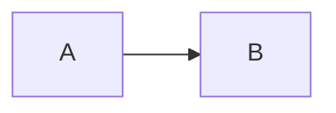
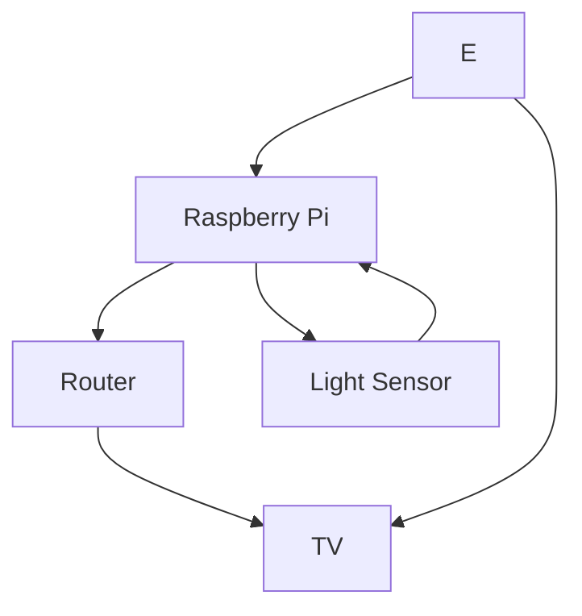

# egl315-msp2

## Name 
Denise Ten 

*Denise Ten*

**Denise Ten**

***Denise Ten***

## School
There are two options to insert code 

### Code Block 
```
I am at Nanyang Polytechnic 
Block S 
Room 540 
```

### Code Line
`sudo raspi-config`


## Adding Picture

This is a fantastic picture of a duck.


## Block Diagram 

Left to Right 


Top to Down
